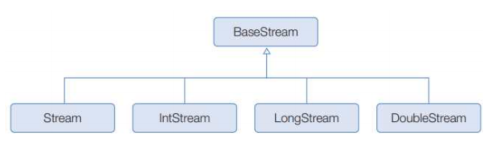
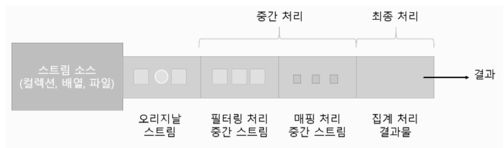

# 16. Stream & Parallel

## \[Stream]

### \[1] Stream의 특징

1. Iterator과 비슷한 역할을 하는 반복자, 람다식으로 요소 처리 코드를 제공. 내부 반복자를 사용하여 병렬 처리가 쉬움.(with 중간처리 및 최종 처리 작업도 수행)\

2. 내부 반복자를 사용하므로 병렬 처리가 쉬움
   1. 외부 반복자(external iterator)
      * 하나의 스레드가 요소들을 순차적으로 읽음
   2. 내부 반복자(internal iterator)
      * 병렬 처리 스트림을 통해 여러개의 스레드가 요소들을 처리 후 최종 결과를 반환함→ ForkJoinPool(스레드풀) 확인 가능
      * 병렬처리 : 한가지 작업을 서브 작업으로 나누고, 서브 작업들을 분리된 스레드에서 병렬적으로 처리하는 것
      * 처리는 컬렉션 내부에서 일어남\

3. 중간 처리와 최종 처리로 나뉨(할 수 있다)
   1. 중간 처리 : 매핑, 필터링, 정렬 수행
   2. 최종 처리 : 반복, 카운팅, 평균, 총합 등의 집계 처리를 수행

<figure><figcaption></figcaption></figure>

### \[2] Stream의 종류

<figure><figcaption></figcaption></figure>

[java.util.stream](http://java.util.stream) 패키지 내에 BaseStream 을 부모로 하여 자식 스트림이 상속관계를 이루고 있음.

* 객체를 처리하는 Stream부터 int, long, double 등 각 기본 타입에 해당하는 요소를 처리
* 주로 컬렉션과 배열로부터 스트림 인터페이스의 구현 객체를 얻지만 int 범위, long범위, 디렉터리, 파일 등으로부터 stream을 얻을 수 있다.

### \[3] Stream Pipeline (스트림 파이프라인)

**리덕션(Reduction)**

* 대량의 데이터를 가공해서 축소하는 것
* 데이터의 합계, 평균값, 카운팅, 최댓값, 최솟값 등이 대표적인 리덕션의 결과물
* 바로 집계가 불가능 한 데이터일 경우 필터링, 매핑, 정렬, 글부핑 등의 중간 처리가 필요

**중간 처리와 최종 처리**

<figure><figcaption></figcaption></figure>

* 스트림은 데이터 필터링,매핑,정렬, 그풉핑 등 중간처리와 데이터의 합계, 평균값, 카운팅, 최댓값, 최솟값 등 최종처리를 파이프라인(pipeline)으로 해결함
* 파이프라인은 여러개의 스트림이 연결되어 있는 구조를 말함
* 최종 처리를 제외하고는 모두 중간 처리 스트림임
* 리턴타입을 통해 중간 처리 메서드와 최종 처리 메서드를 구분할 수 있음
  * 스트림 → 중간 처리 메서드
  * 기본 타입 or OptionalXXX → 최종 처리 메서드

### \[4] 필터링(distinct(), filter())

* 중간 처리 기능으로 요소를 걸러내는 역할
* distinct()와 filter()는 모든 스트림이 가지고 있는 공통 메서드
* distinct()
  * 중복 제거
  *   Object.equals(Object) 가 true이면 동일한 객체로 판단하고 중복 제거

      (Int, Long, Double Stream일 경우엔 동일한 값일 경우 중복 제거)
* filter()
  * 조건 필터링
  * 매개값으로 주어진 Predicate가 true를 리턴하는 요소만 필터링

### \[5] 매핑(flatMapXXX(), mapXXX(), asXXXStream(), boxed())

매핑(mapping) : 중간 처리 기능으로 스트림의 요소를 다른 요소로 대체하는 작업

* flatMapXXX()
  * 요소를 대체하는 복수 개의 요소들로 구성된 새로운 스트림을 리턴(요소 → 복수개의 요소)
* mapXXX()
  * 요소를 대체하는 요소로 구성된 새로운 스트림을 리턴(요소 → 단일 요소)
* asXXXStream()
* boxed())

### \[6] 정렬 (sorted())

스트림은 요소가 최종 처리되기 전에 중간 단계에서 요소를 정렬해서 최종 처리 순서를 변경할 수 있음

* Comparable 을 구현한 요소에서만 sorted()를 호출할 수 있음

### \[7] 루핑(peek(), forEach())

루핑(looping)은 요소 전체를 반복하는 것을 말함, 두 메서드는 루핑하는 기능은 동일하지만 동작 방식이 다름

peek() : 중간처리 메서드

forEach() : 최종 처리 메서드

### \[8] 매칭(allMatch(), anyMatch(), noneMatch())

스트림은 최종 처리 단계에서 요소들이 특정 조건에 만족하는지 조사하는 매칭 메서드 제공

* allMatch() : 매개값으로 주어진 Predicate 조건에 맞는지 조사
* anyMatch() : 최소한 한개의 요소가 매개값으로 주어진 Predicate의 조건을 만족하는지 조사
* noneMatch() : 모든 요소들이 매개값으로 주어진 Predicate의 조건을 만족하지 않는지 조사

### \[9] 기본 집계(sum(), count(), average(), max(), min())

집계(Aggregate)는 최종 처리 기능으로 요소들을 처리해서 카운팅, 합계, 평균값, 최댓값, 최솟값 등과 같이 하나의 값으로 산출하는 것을 말함.

집계는 대량의 데이터를 가공해서 축소하는 리덕션(Reduction)이라고 볼 수 있음.

*   Optional 클래스

    단순히 집계 값만 저장하는 것이 아니라, 집계 값이 존재하지 않을 경우 default값을 설정할 수 있고,집계값을 처리하는 Consumer도 등록할 수 있음.

### \[10] 커스텀 집계(reduce())

스트림은 기본 집계 메서드인 sum(), average(), count(), max(), min()을 제공.

→ 다양한 집계 결과물을 만들기 위해 reduce() 메서드 제공

* 스트림에 요소가 전혀 없을 경우, default 값인 identity 매개값이 리턴됨

### \[11] 수집(collect())

스트림은 요소들을 필터랑/매핑 후 요소들을 수집하는 최종 처리 메서드인 collect()를 제공하고 있음.

필요한 요소만 컬렉션에 담고 그룹핑 후 집계(reduction)할 수 있음

### \[12] 병렬 처리

하나의 작업을 분할해서 각각의 코어가 병렬적으로 처리하는 것. → 작업 처리 시간을 줄이기 위함(병렬 스트림 사용)

* 동시성(Concurrency)과 병렬성(Parallelism)
  * 동시성 : 멀티 작업을 위해 멀티스레드가 번갈아가며 실행하는 성질
  * 병렬성 : 멀티 작업을 위해 멀티 코어를 이용해서 동시에 실행하는 성질

* 데이터 병렬성
  * 데이터 병렬성은 전체 데이터를 쪼개서 서브 데이터들로 만들고, 이 서브 데이터들을 병렬 처리해서 작업을 빨리 끝내는 것을 말함
  * 자바8에서 병렬 스트림은 데이터 병렬성을 구현한 것
  * 멀티 코어의 수만큼 대용량 요소를 서브 요소들로 나누고, 각각의 서브 요소들을 분리도니 스레드에서 병렬처리 시킴

* 작업 병렬성
  * 대표적 예 : 웹 서버(Web Server)
  * 각각의 브라우저에서 요청한 내용을 개별 스레드에서 병렬로 처리

* 포크조인(ForkJoin) 프레임워크
  * 병렬 처리하기 위해 포크조인(ForkJoin) 프레임워크(Framework) 사용
  * 전체 데이터 → 서브데이터로 분리 → 멀티 코어에서 병렬로 처리 → 조인 단계에서 결과를 결합하여 최종 결과를 생성
  * ExecutorService의 구현 객체인 ForkJoinPool을 사용해서 작업 스레드를 관리

* 병렬 스트림 생성(2가지 메서드)
  * parallelStream() : 컬렉션으로부터 병렬 스트림을 바로 리턴
  * parallel() : 순차 처리 스트림을 병렬 처리 스트림으로 변환해서 리턴

*   병렬처리 성능

    무조건적으로 순차 스트림보다 좋은게 아님. 아래 3가지 요인을 살펴봐야함

    1. 요소의 수와 요소당 처리 시간
       * 요소의 수가 적고 요소당 처리 시간이 짧으면 순차 처리가 병렬 처리보다 빠를 수 있음.
       * 병렬처리는 스레드풀 생성, 스레드 생성이라는 추가 비용이 발생함
    2. 스트림 소스의 종류
       * ArrayList, 배열은 인덱스로 요소를 관리함
    3. 코어(Core)의 수
       * 싱글 코어일 경우 순차 처리가 빠름
       * 싱글 코어에서 병렬 스트림을 사용하면 스레드의 수만 증가하고 동시성 작업으로 처리되기 때문에 결과가 안좋음
       * 코어의 수가 많을수록 병렬 작업 처리 속도는 빨라짐

