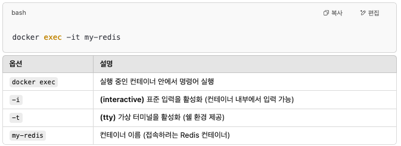

# nano vs vim(vi)

<figure><figcaption>
vim vs nano
</figcaption></figure>

nano와 vim 모두 cli 터미널 기반 편집기입니다. nano는 작업이 간편하고 원하는 것을 편집하는데에 도움이 됩니다. Vim은 유연하며 작업을 더 빠르게 완료하고 더 많은 기능을 원하면 Vim으로의 전환을 고려하면 좋습니다.

*   **vi & vim** : 입력모드, 명령모드, 마지막 행 모드

    * vim은 1991년에 개발된 “Vi” 텍스트 편집기의 개선된 버전으로 “Vi Improved”를 의미합니다.
    * 명령 모드(Command Mode) : 특정 기능을 하는 명령어를 입력하는 모드
      * i : 삽입 기능을 가진 명령
    * 입력 모드(Insert Mode) :
      * i (insert) or a : (텍스트 입력 모드) i 혹은 a를 누른 후에는 명령이 아닌 일반 텍스트로 취급.
    * 마지막 행 모드(Last Line Mode)
      * :(콜론)을 누르면 동작하는 모드를 말함.
      * w(write, 저장), q(quit, 나가기), 취소(!) 등의 기능이 있다. 저장하지 않고 나가려면 ‘:’ 콜론 이후 ‘q!’ 를 작성하면 된다.
      * ‘:’ 를 누르면 화면 맨 아래에 커맨드 라인이 생기고 그곳에 명령어를 작성하게 동작하기 때문에 ‘마지막 행 모드’ 라는 이름이 붙었다.

    → 즉 vim을 실행하면 명령 모드가 default로 시작된다. i를 통해서 입력모드로, 다시 ESC(혹은 ctrl+c)를 통해서 명령모드로 이동할 수 있다. ‘:’ 을 통해서 마지막 행 모드로, 다시 ESC를 통해서 명령모드로 이동할 수 있다.
* vi 명령어
  * 되돌리기 기능 \
    **undo** : ‘ctrl+z’는 vi환경에서 명령모드일 때 ‘u’키를 눌러서 작업을 되돌릴 수 있다. \
    **redo** : ’ctrl + shift + z’ 과 같이 다시 되돌리는 명령은 ‘ ctrl + r’을 사용할 수 있다.
  * 검색 기능 : 명령 모드에서 ‘/search\_word’ 작성하여 검색. 추가(next) 검색은 ‘n’ 을 눌러서 search\_word에 해당하는 것들을 연속하여 검색. \
    (명령모드에서 ‘/search\_word’ 후 엔터 후 ‘n’을 통해 연속 검색)

***

* **nano :**
  * nano는 Pico에서 영감을 받은 간단한 터미널 기반의 텍스트 편집기입니다. Unix 기반 텍스트 편집기는 1989년 워싱턴 대학에서 개발한 Pine 이메일 제품군의 일부였습니다.
  * 이 편집기는 학습 곡선이 적어 사용자 친화적이라고 간주됩니다.
  * Ctrl + K : 잘라내기
  * Ctrl + U : 붙여넣기
  * Ctrl + X : 종료
  * Ctrl + O : 다른이름으로 저장
  * Alt + U : 마지막 작업을 취소(ctrl + z 와 같은 기능)
  * Ctrl + ← : 한 단어 뒤로
  * Ctrl + → : 한 단어 앞으로
  * Ctrl + F : 커서를 앞으로 이동( -> )
  * Ctrl + B : 커서를 뒤로 이동 ( <- )
  * undo : Esc + U&#x20;
  * redo : Esc + E
  * Ctrl + W : 문자열 검색
