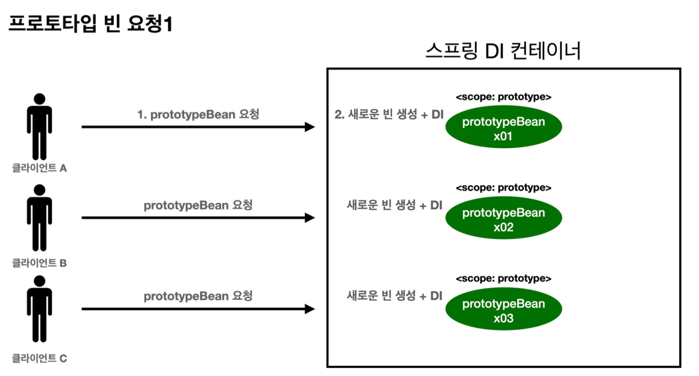

# JWT(Json Web Token)

```java
JWT란?

Json Web Token의 약자로 JSON 개체로 안전하게 전송하기 위한 
간결하고 독립적인 방법을 정의하는 개방형 표준(RFC 7519)입니다. 이 정보는
디지털 서명이 되어 있으므로 신뢰할 수 있습니다. JWT의 secret-key는 RSA 또는
ECDSA를 사용하여 공개/개인 키 쌍을 사용하여 서명할 수 있습니다.
```

*   JWT 구조

    ```
    eyJ0eXAiOiJKV1QiLCJhbGciOiJIUzI1NiJ9.
    eyJzdWIiOiJueTI0ODUiLCJyb2xlcyI6WyJVU0VSX1JPTEUiXSwiaWF0IjoxNzA2MTE2NDQwLCJleHAiOjE3MTEzMDA0NDB9.
    pSEpbVBgzU-INYiRsw4LsDoyWnw0D2BQJltgCEDKlno
    ```

    JWT는 이렇게 ‘`.`’ 을 기준으로 세부분으로 나뉜 Base64-URL 문자열이며 SAML과 XML 기반 표준과 비교해서 더 간결하다. header, payload가 인코딩되어있고 secret signed JWT를 나타낸다.

    1.  **Header**

        <figure><figcaption></figcaption></figure>

        Header는 토큰의 타입(typ)와 암호화에 사용된 알고리즘을 나타낸다. 그리고 이 JSON 형태는 Base64Url로 인코딩되어 JWT 첫번째 부분을 구성한다.

        \*`secretKey* = Base64.*getEncoder*().encodeToString(*secretKey*.getBytes());`
    2.  **Payload**

        payload에서는 Claims를 포함한다. Claims는 entity(유저정보)에 대한 상태와 추가적인 정보들을 담고있다. claims에는 (1) registered, (2) public, (3) private claims 세가지 타입의 claims가 있다.

        (1) registered claims

        필수는 아니지만 권장되는 미리 정의된 클레임 집합이다.

        그 중 일부는 **iss** (발행자), **exp** (만료 시간), **sub** (주제), **aud** (청중)등으로 구성되어 있다 .

        (2) public claims

        사용자가 원하는 대로 정의할 수 있다. 하지만 충돌을 방지하기 위해서 IANA JSON web token registry에 정의하거나 충돌 방지 네임스페이스를 포함하는 URI로 정의해야 한다.

        (3) private claims

        정보를 공유하기 위한 custom claims이다. 사용에 동의한 사용자, registered, public 을 제외한 claims이다.

        Base64Url로 인코딩되어 JWT 두번째 부분을 구성한다.

        ```
        서명된 토큰의 경우 이 정보는 변조로부터 보호되지만 누구나 읽을 수 있다. 
        암호화되지 않은 경우 JWT의 페이로드 또는 헤더 요소에 비밀 정보를 넣으면 보안상 좋지 않다.
        ```


    <figure><figcaption></figcaption></figure>

    1.  **Signature**

        signature를 생성하기 위해서는 encoded header, encoded payload, secret-key, 헤더에 들어갈 특정 알고리즘과 사인등이 필요하다.

        ex) HMAC SHA256

        ```java
        HMACSHA256(
          base64UrlEncode(header) + "." +
          base64UrlEncode(payload),
          secret)
        ```

        signature은 메시지가 변조되었는지 확인하는데에 사용되며, token은 private key로 사인되어 JWT를 보낸사람이 누군지 증명하는데에 사용된다.


    #### 그래서 JSON Web Token은 어떻게 동작하는가?

    인증 시 사용자가 자격 증명을 사용해 성공적으로 로그인하면 JSON Web Token이 반환된다. 일반적으로 토큰을 필요한 것보다 오래 보관하면 안된다. 또한 민감한 데이터를 브라우저 저장소등에 보관하면 안된다. 사용자가 보호된 경로 혹은 리소스에 접근하려 할 때마다 일반적으로 Bearer 스키마를 사용해서 Authorization - header에 JWT를 보내야 한다.

    `Authorization : Bearer <token>`

    이 방법은 stateless 하며 인증이 필요한 경로/페이지 에서는 유효한 JWT를 인증을 확인하고 JWT가 인증이 되면 보호된 리소스에 접근이 가능하다. 또한 HTTP header를 통해 JWT를 보내는 경우 token이 너무 커지지 않도록 주의해야 한다. 일부 서버는 8KB 이상을 허용하지 않는 경우가 있다. 또 만약 너무 많은 정보를 포함해야 할 경우에는 `Auth0 Fine-Grained Authorization` 와 같은 방법을 모색해봐야 한다.

    토큰이 Authorization 헤더로 전송되면 CORS(Cross-Origin-Resource Sharing)는 쿠키를 사용하지 않기에 문제가 되지 않는다.

    JWT를 사용해서 접근이 제한된 리소스나 API 에 접근하려면 아래와 같은 순서도로 진행된다.

    <figure><figcaption></figcaption></figure>

    1. application이나 client에서 서버(혹은 권한 서버)에 인증을 요청한다.
    2. 인증이 되면 권한을 부여받고, 권한 서버는 토큰을 application/client로 돌려주게 된다.
    3. application user는 protected resource(or API)에 접근하기 위해 access-token을 사용하게 된다.

#### 그래서 왜 JSON Web Token을 사용해야 하나?

Simple Web Tokens(SWT), Security Assertioin Markup Language Tokens(SAML)과 JWT를 비교해보자.

SAML의 경우에는 XML 형식이다. JSON형식의 JWT에 비해서 장황하기에 HTML이나 HTTP 환경에서 전달되기에 좋은 선택지는 아니다.

(보안측면에서) SWT는 HMAC 알고리즘을 사용하고 shared secret(공유키)를 통해서만 symmetrically 서명한다. 하지만 JWT와 SAML의 경우엔 public/private key pair를 사용할 수 있다.

JSON parser는 객체에 직접 매핑되기 때문에 대부분의 프로그램에서 일반적으로 사용된다. 반대로 XML에는 자연스러운 문서-객체 매핑이 없다. SAML보다는 JWT 작업이 더 간결하다고 볼 수 있다. 그렇기에 인터넷규모에서 모바일 등 여러 플랫폼에서 JWT를 사용한 클라이언트 측 처리 용이성이 쉬워지기에 JWT가 대중화 되었다고 볼 수 있다.

> 참고 : [https://jwt.io/introduction](https://jwt.io/introduction) \
> JWT debugger : [https://jwt.io/#debugger-io](https://jwt.io/#debugger-io)
