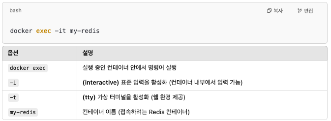

# Docker


```bash
$ docker pull redis
$ docker run --name my-redis -d -p 6379:6379 redis
$ docker ps
$ docker exec -it my-redis redis-cli
```

<figure><figcaption></figcaption></figure>

<figure><figcaption></figcaption></figure>
