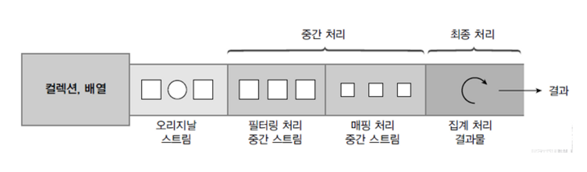

# Spring Bean Scope

*   Bean Scope


    * spring이 지원하는 scope들
      1. singleton
         1. default scope,
         2. 스프링 시작, 종료까지 유지되는 가장 넓은 범위의 스코프
      2. proto type
         1. proto-type 빈의 생성과 주입까지만 관여하고 더는 관리하지 않는 매우 짧은 범위의 스코프
      3. web 관련 scope
         * request : 웹 요청이 들어오고 나갈때 까지 유지되는 scope
         * session : 웹 세션이 생성되고 종료될 때 까지 유지되는 scope
         * application : 웹의 서블릿 컨텍스트와 같은 범위로 유지되는 scope


    *   컴포넌트 스캔 자동 등록

        ```java
        @Scope("prototype")
        @Component
        public class BeanCreate {}
        ```


    *   수동 등록

        ```java
         @Scope("prototype")
         @Bean
         PrototypeBean BeanCreate() {
             return new BeanCreate();
         }
        ```


*   #### \[1] 프로토타입 스코프(proto-type scope)

    *   **싱글톤 스코프**의 빈을 조회하면 스프링 컨테이너는 항상 같은 인스턴스의 스프링 빈을 반환한다.

        <figure><figcaption></figcaption></figure>
    *   반면에 **프로토타입 스코프**일때 스프링 컨테이너에 조회하면 스프링 컨테이너는 항상 새로운 인스턴스를 생성해서 반환한다.

        *   **프로토타입 빈 요청1**

            1. 프로토타입 스코프 빈을 스프링 컨테이너에 요청하여 가져오기 시도
            2. 스프링 컨테이너는 이 시점에 프로토타입 빈을 생성하고, 필요한 의존관계를 주입함.

            <figure><figcaption></figcaption></figure>
        *   **프로토타입 빈 요청2**

            <figure><figcaption></figcaption></figure>

            &#x20;3\.  스프링 컨테이너는 생성한 프로토타입 빈을 클라이언트에 반환한다.

            &#x20;4\.  이후에 스프링 컨테이너에 같은 요청이 오면 항상 새로운 프로토타입 빈을 생성해서 반환한다.

        ***

        \
        여기서 **핵심은 스프링 컨테이너는 프로토타입 빈을 생성하고, 의존관계 주입, 초기화까지만 처리한다는 것이다.** 클라이언트에 빈을 반환하고, 이후 스프링 컨테이너는 생성된 프로토타입 빈을 관리하지 않는다. 프로토타입 빈을 관리할 책임은 프로토타입 빈을 받은 클라이언트에 있다. 그래서 `@PreDestroy` 같은 종료 메서드가 호출되지 않는다.\


        이하 코드상에서 확인 가능 : [https://github.com/young0264/spring-playground/tree/main/src/test/java/spring/playground/basic/scope](https://github.com/young0264/spring-playground/tree/main/src/test/java/spring/playground/basic/scope)

    ***

    * 즉,
      * 싱글톤 빈은 스프링 컨테이너 생성 시점에 초기화 메서드가 실행 되지만, 프로토타입 스코프의 빈은 스프링 컨테이너에서 빈을 조회할 때 생성되고, 초기화 메서드도 실행됨
      *   싱글톤 빈은 스프링 컨테이너가 관리하기 때문에 스프링 컨테이너가 종료될 때 빈의 종료 메서드가 실행되지만,

          프로토타입 빈은 스프링 컨테이너가 생성과 의존관계 주입 그리고 초기화 까지만 관여하고, 더는 관리하지 않는 다. 따라서 프로토타입 빈은 스프링 컨테이너가 종료될 때 `@PreDestroy` 같은 종료 메서드가 전혀 실행되지 않는다.

    ***

    * 프로토타입 빈 특징 정리
      * 스프링 컨테이너에 요청할 때 마다 새로운 인스턴스가 생성됨
      * 프로토타입 빈의 생성과 의존관계 주입 그리고 초기화까지만 관여함
      * 종료 메서드(`@PreDestroy`)가 호출되지 않음.
      * 프로토타입 빈은 그걸 조회한 클라이언트가 관리해야함. 종료메서드에 대한 호출도 클라이언트가 직접 해야함.

    ####

    ***

    ***

    ***

    ####

    #### \[2] **프로토타입 스코프** - **싱글톤 빈과 함께 사용시 문제점**


    프로토 타입 사용시 빈 요청을 하면 항상 새로운 객체 인스턴스를 생성하여 반환함.

    하지만 싱글톤 빈과 함께 사용할 때는 의도한 대로 동작하지 않음.

    **프로토타입 빈 직접 요청**

    *   **스프링 컨테이너에 프로토타입 빈 직접 요청1**\


        <figure><figcaption></figcaption></figure>
    *   **스프링 컨테이너에 프로토타입 빈 직접 요청2**\


        <figure><figcaption></figcaption></figure>

    \
    **싱글톤 빈에서 프로토타입 빈 사용**

    <`clientBean` 이라는 싱글톤 빈이 의존관계 주입을 통해서 프로토타입 빈을 주입받아서 사용하는 예>

    *   **싱글톤에서 프로토타입 빈 사용1**

        <figure><figcaption></figcaption></figure>

        <`clientBean` 은 싱글톤이므로, 보통 스프링 컨테이너 생성 시점에 함께 생성되고, 의존관계 주입도 발생함>

        1. clientBean은 의존관계 자동 주입을 사용한다. 주입 시점에 스프링 컨테이너에 프로토타입 빈을 요청함
        2. 스프링 컨테이너는 프로토타입 빈을 생성해서 `clientBean` 에 반환한다. 프로토타입 빈의 count 필드 값은 0이다.
        3. 이제 `clientBean` 은 프로토타입 빈을 내부 필드에 보관함. (정확히는 참조값을 보관함)\

    *   **싱글톤에서 프로토타입 빈 사용2**

        <figure><figcaption></figcaption></figure>

        클라이언트 A는 `clientBean` 을 스프링 컨테이너에 요청해서 받는다.싱글톤이므로 항상 같은 `clientBean`이 반환된다.

        1. 클라이언트 A는 `clientBean.logic()` 을 호출한다.
        2. `clientBean` 은 prototypeBean의 `addCount()` 를 호출해서 프로토타입 빈의 count를 증가한다. count값이 1이 된다.
    *   **싱글톤에서 프로토타입 빈 사용3**\


        <figure><figcaption></figcaption></figure>

        클라이언트 B는 `clientBean` 을 스프링 컨테이너에 요청해서 받는다.싱글톤이므로 항상 같은 `clientBean` 이 반환된다.\


        **여기서 중요한 점이 있는데, clientBean이 내부에 가지고 있는 프로토타입 빈은 이미 과거에 주입이 끝난 빈이다. 주입 시점에 스프링 컨테이너에 요청해서 프로토타입 빈이 새로 생성이 된 것이지, 사용 할 때마다 새로 생성되는 것이 아니다!**\


        1. 클라이언트 B는 `clientBean.logic()` 을 호출한다.
        2. `clientBean` 은 prototypeBean의 `addCount()` 를 호출해서 프로토타입 빈의 count를 증가한다. 원래 count 값이 1이었으므로 2가 된다.

    ***

    > 여러 빈(singleton)에서 같은 프로토타입 빈을 주입받으면, 각각 **새로운 인스턴스를 갖는 프로토타입 빈이 생성**됨 (사용때마다 새로 생성되는 것은 아님)


    ####

    ***

    ***

    ***

    ####

    #### \[3] **프로토타입 스코프** - **싱글톤 빈과 함께 사용시** Provider**로 문제 해결**

    * 의존관계를 외부에서 주입받는게 아니라, 직접 필요한 의존관계를 찾는 것 : DL
      * 해당 코드 변경점 : [https://github.com/young0264/spring-playground/commit/9c397f7968a175b5b8887047e04c4cbded805153](https://github.com/young0264/spring-playground/commit/9c397f7968a175b5b8887047e04c4cbded805153)
      * 실행해보면 `ac.getBean()` 을 통해서 항상 새로운 프로토타입 빈이 생성되는 것을 확인할 수 있다. 의존관계를 외부에서 주입(DI) 받는게 아니라 이렇게 직접 필요한 의존관계를 찾는 것을 Dependency Lookup (DL) 의존관계 조회(탐색) 이라한다. 그런데 이렇게 스프링의 애플리케이션 컨텍스트 전체를 주입받게 되면, 스프링 컨테이너에 종속적인 코드가 되고,단위 테스트도 어려워진다. 지금 필요한 기능은 지정한 프로토타입 빈을 컨테이너에서 대신 찾아주는 딱! **DL** 정도의 기능만 제공하는 무언가가 있으면 된다.

    \
    **ObjectFactory, ObjectProvider (스프링에 의존), Lazy Loading 지원**

    ```java
    public interface ObjectProvider<T> extends ObjectFactory<T>, Iterable<T> {
    ...
    }
    ```

    ```java
    @Autowired
     private ObjectProvider<PrototypeBean> prototypeBeanProvider;
     public int logic() {
         PrototypeBean prototypeBean = prototypeBeanProvider.getObject();
         prototypeBean.addCount();
         int count = prototypeBean.getCount();
         return count;
    }
    ```


    * prototypeBeanProvider.getObject() 을 통해서 항상 새로운 프로토타입 빈이 생성
    * ObjectProvider의 getObject() 를 호출하면 내부에서는 스프링 컨테이너를 통해 해당 빈을 찾아서 반환
    * 스프링이 제공하는 기능을 사용하지만, 기능이 단순하므로 단위테스트를 만들거나 mock 코드를 만들기는 훨씬 쉬워짐.
    * ObjectProvider 는 필요한 DL의 기능만 제공함
    * ObjectFactory: 기능이 단순, 별도의 라이브러리 필요 없음, 스프링에 의존
    * ObjectProvider: ObjectFactory 상속, 옵션, 스트림 처리등 편의 기능이 많고, 별도의 라이브러리 필요 없음, 스프링에 의존

    \
    **JSR-330 Provider (자바 표준)**

    * `javax.inject.Provider` 라는 JSR-330 자바 표준을 사용하는 방법
    * 라이브러리 추가 필요
    * 자바 표준으로써 스프링이 아닌 다른 컨테이너에서도 사용 가능.

#### **\[4] 웹 스코프**

* 특징
  * 웹 스코프는 웹 환경에서만 동작한다.
  * 웹 스코프는 프로토타입과 다르게 스프링이 해당 스코프의 종료시점까지 관리한다. 따라서 종료 메서드가 호출된다.\

*   웹 스코프 종류

    * **request:** HTTP 요청 하나가 들어오고 나갈 때 까지 유지되는 스코프, 각각의 HTTP 요청마다 별도의 빈 인스턴스가 생성되고, 관리된다.
      * request scope bean은 client로 부터 요청이 와야 생성가능.
    * **session:** HTTP Session과 동일한 생명주기를 가지는 스코프
    * **application:** 서블릿 컨텍스트(`ServletContext`)와 동일한 생명주기를 가지는 스코프
    * **websocket:** 웹 소켓과 동일한 생명주기를 가지는 스코프

    ***

    *   예제 1) request scope `@Scope(value = "request")`

        *   동시에 여러 HTTP 요청이 오면 어떤 요청이 남긴 로그인지 구별하기 어려움.

            → request scope 사용. + UUID
        *   singleton bean은 spring application 실행 시점에 생성해서 주입이 가능,

            하지만 **request scope bean**은 아직 생성되지 않음. 실제 고객의 요청이 와야 사용이 가능함. (+ **session scope**)

        ```bash
        Scope 'request' is not active for thecurrent thread;
        consider defining a scoped proxy for this bean if you intend to
         refer to it from a singleton;
        ```


* **스코프와 Provider**
  * (scope가 request나 session일 때)
    * ObjectProvider를 사용하여 singleton과 달리 getObject()를 호출하는 시점까지 request scope bean의 생성을 지연할 수 있음.
    * getObject()를 호출하는 시점에 HTTP 요청이 진행중이기에 bean의 생성이 정상 처리 됨.


*   **스코프와 프록시**

    * (scope가 request나 session일 때)

    <figure><figcaption></figcaption></figure>

    *   `@Scope(value = "request", proxyMode = ScopedProxyMode.TARGET_CLASS)`

        을 사용하면 spring container는 CGLIB 이라는 바이트 코드를 조작하는 라이브러리를 사용하게 됨. MyLogger를 상속받은 가짜 프록시 객체를 생성함.

        `myProxyLogger getClass : class spring.playground.basic.common.MyLogger$$SpringCGLIB$$0` 처럼 log가 나옴.

        ```java
        // 적용대상 : class에 대한 (TARGET_CLASS) 
        // proxy 생성 -> HTTP reuqest와 상관 없이 가짜 프록시 클래스를 다른 빈에 미리 주입 가능
         @Component
         @Scope(value = "request", proxyMode = ScopedProxyMode.TARGET_CLASS)
         public class MyLogger {
        }
        ```


    * 가짜 프록시 객체는 요청이 오면 그때 내부에서 진짜 bean을 찾는 내부 위임 로직이 있음.
      * 클라이언트는 가짜 프록시 객체의 myLogger.log() 를 호출
      * 가짜 프록시 객체에서는 request 스코프의 진짜 myLogger.log()를 호출
      * 가짜 프록시 객체는 원본 클래스를 상속받아 만들어졌기 때문에 클라이언트는 원본인지 아닌지도 모르게 그냥 동일하게 사용할 수 있음(다형성)


    * 동작
      * CGLIB이라는 라이브러리로 내 클래스를 상속 받은 가짜 프록시 객체를 만들어 주입함
      * 가짜 프록시 객체는 실제 요청이 오면 그때 내부에서 실제 빈을 요청하는 위임 로직이 들어있음
      * 가짜 프록시 객체는 실제 request scope와는 관계가 없음. 그냥 가짜이고 내부에 단순 위임 로직만 있고 싱글톤 처럼 동작함.


    * 정리
      * 지정한 빈을 컨테이너에서 대신 찾아주는 DL 서비스를 제공하는 것이 바로 `ObjectProvider`.
      * provider를 사용하거나 프록시 객체를 사용하거나, 중요한 점은 진짜 객체 조회를 필요한 시점까지 지연처리 한다는 점.
      * 어노테이션 변경 만으로 원본 객체 조회하던걸 프록시 객체 조회로 바꿀 수 있음.
      * 웹 스코프가 아니더라도 프록시는 사용할 수 있음
      * 싱글톤을 사용하는 것 처럼보이는 것이지 싱글톤이 아니기에 주의해야하며, 이런 특별한 scope는 필요한 곳에서 최소한을 사용(유지보수가 어려울 수 있음)
