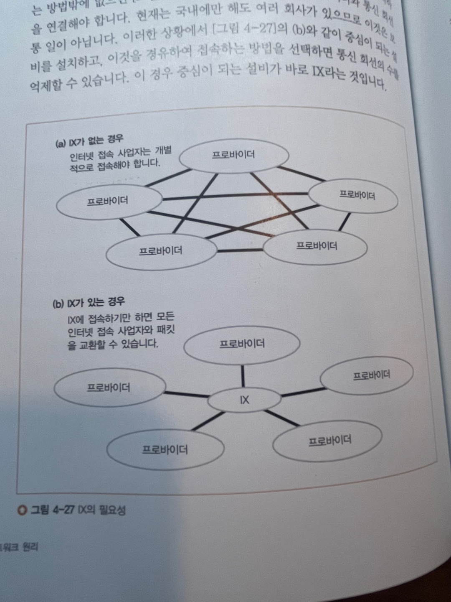

# Access Circuit & Provider

*   **\[1] ADSL 기술을 이용한 액세스 회선의 구조와 동작**

    * ADSL :
      * 금속제 케이블(전화선)을 이용해 고속으로 통신하는 기술의 일종
      * ADSL에서 MAC헤더, PPPoE를 붙여서 신호를 변환 후 송신함
    * FTTH (Fiber To The Home) : 집까지 광섬유를 끌어온다는 것
    * **PPP, PPPOE (통신 보조 기기 )**
      * 인증과 관련된 헤더.
      * PPP(Point-to-Point Protocol) : 두 지점간에 1:1 통신을 수행하는 프로토콜. 사용자 인증 기능이 있음. 주로 선화선을 이용해 인터넷에 접속
      * PPPOE : PPP와 (근거리 통신망에서 여러명의 사용자들을 지원하는) 이더넷 프로토콜이 결합된 것.(PPP의 발전된 형태)

    ***

    * **ADSL의 통신 순서(방법)**
      1. 허브 → 라우터 → 인터넷 접속용 라우터
      2. 인터넷 접속용 라우터 → ADSL 모뎀 (MAC주소와 PPPOE, PPP헤더를 붙여서 전송)
      3. 셀을 세분화
      4. 전기 신호로 변환 송출
      5. 스플리터
         1. 신호가 들어올 때 전화와 ADSL의 신호를 나누는 역할을 함
         2. ADSL의 높은 주파수 신호를 차단하여 신호를 분리함
      6. DSLAM (전화국 모뎀집합)
         1. 신호의 파형을 읽어서 비트값에 대응해 디지털 데이터로 복원함
         2. 패킷을 분할한 셀의 형태 그대로 뒷쪽의 라우터와 통신을 주고받음.
      7. BAS(패킷 중계 장치)에 도착
         1. DSLAM과 ATM인터페이스가 존재하는데 ATM인터페이스를 사용해서 숫니한 셀을 원래의 패킷으로 복원하고 BAS의 수신동작은 끝이남
         2. 그리고 패킷의 앞부분에 MAC헤더와 PPPoE헤더를 버리고(BAS의 인터페이스에 패킷을 건네주기 위해 사용) PPP헤더 이후의 부분을 추출함.
         3. 그리고 터널링용 헤더를 붙여서 터널링을 향해 중계함. 이후 터널링용 헤더를 분리하고 IP패킷을 추출하여 인터넷의 내부에 중계함.
    *   정리

        * 허브에서 라우터, 인터넷 접속용 라우터
        *   인터넷 접속용 라우터 → ADSL 모뎀으로 전송 : 이때 새로운 MAC주소와 PPPOE, PPP헤더를 붙여서 전송을 해야함.

            MAC 주소는 모뎀에 전송을 하기 위함이고, **PPPOE와 PPP는 인증과 관련된 헤더**임.
        * ADSL 모뎀에 도착을 하면 받은 모든 데이터를 ATM을 이용해 셀로 분할함. 셀로 분할 후 전기 신호로 변환해서 송출함
          * 데이터를 셀로 분할하는 이유?
            * 검색 및 조회 성능 향상
          * `스플리터` 는 왜 필요한가?
            * ADSL은 전화선을 이용하는 통신.
            * 이렇게 전기신호로 바꿔서 사용하고 있는데 데이터 전기 신호를 추가해서 사용하게 되면 데이터가 정확하게 전달이 되지 않을 가능성이 생김
            * 그래서 이런 경우 데이터 신호를 분리해주는 역할이 필요한데 이 기능을 스플리터가 하게 됨.
            * 음성신호를 따로 추출해서 보내고, 데이터 신호도 따로 추출해서 보냄.
        * ADSL 신호를 한 곳으로 모아서 관리하는 **DSLAM**에 도착함. DSLAM은 크게 IDO / MDF 2가지로 나뉘어짐. ( MDF : 주 배선반, IDF : 중간 배선반 )
        * DSLAM을 통화해서 BAS에 도착하게 됨. BAS의 역할은 ADSL 모뎀에서 ATM을 이용해 데이터를 셀로 분할했는데 BAS에서는 분할한 데이터를 다시 원상복구 시킨 다음에 라우터를 통해 인터넷 접속용 라우터로 보내게 됨.

        ```jsx
        - 인터넷 접속용 라우터에서 새로운 MAC주소와 PPPOE, PPP헤더를 추가해서 ADSL모뎀으로 전송
        - ADSL 모뎀은 수신한 패킷을 ATM을 이용해 셀로 분할이 완료되면 전기 신호로 변환하여 스프리터로 송출
        - 스플리터는 전화용 주파수 와 데이터용 주파수 를 분리한 후 각각에 전송함
        - DSLAN에 전기 신호를 수신하고 ATM셀에 되돌려 송신. 이때 전기 신호를 ATM셀로 변환. 
        	그리고 BAS에 전달
        - BAS는 셀로 분할된 패킷을 원래 형태로 되돌림. MAC헤더 제거, PPPOE 헤더 제거, PPP패킷만 추출
        	, 터널리용 헤더를 붙여서 인터넷 접속용 라우터에 도착시킴
        인터넷 접속용 라우터 -> 라우터 -> 허브 -> 3장/2장/1장
        ```

    ***
*   **\[2] 광섬유를 이용한 액세스 회선(FTTH)**

    `FTTH는 ADSL처럼 통신을 하는데 광섬유를 사용하여 통신함.`

    * FTTH ( From To The Home) : 빛이 들어와서 밝기로 통신을 함. 디지털 신호로 구분. 밝으면 1, 어두우면 0
    * FTTH는 광섬유 제작 방식엔 싱글모드, 멀티모드 2가지로 나뉨.
      * **싱글 모드**는 광섬유에 1개의 빛을 이용해서 통신
        * 거리가 먼곳에 사용 (1개의 빛을 보내기 때문에 도착시간이 달라지는 신호의 변형이 없음)
      * **멀티모드**는 광섬유에 2개 이상의 빛을 보내 통신
        * 거리가 가까운 곳에 사용 (2개 이상의 빛을 보내기 때문에. 광원에 따라 반사각이 큰쪽은 거리가 길어져 도착시간이 달라지는 신호의 변형이 생길 가능성이 큼)
        * 주로 회사 건물내에서 사용.
        * 빛의 수가 많기 때문에 데이터 처리 속도가 빠름.
    * 광섬유를 분기시켜서 비용을 절감할 수 있는 특징이 있음.
*   **\[3] 액세스 회선으로 이용하는 PPP와 터널링**

    * PPP의 동작 과정
      1. 프로바이더의 액세스 포인트에 전화를 걸고
      2. 전화가 연결되면 사용자명과 패스워드를 입력 - 로그인시도를 함
      3. 사용자명과 패스워드는 `RADIUS` 라는 프로토콜을 사용해서 `RAS` 에서 본인 확인용 서버에 전송되고 여기에서 정확한지 검사를 받음
      4. 인증이 정확하면 IP주소를 사용자 측에 전달해 받음
      5. 사용자 PC는 이 IP를 설정해 TCP/IP로의 송/수신할 준비가 완료되고 TCP/IP 패킷 송수신동작으로 넘어감.
    * ADSL이나 FTTH는 BAS를 케이블로 고정적으로 접속하므로 본인인증이 필요하지 않은 경우가 있음. 하지만 사용자명과 패스워드를 입력하는 동작을 남겨두면 사용자명에 따라서 프로바이더를 전환할 수 있어서 편리함.
    * 다이얼업 접속에서 PPP를 그대로 ADSL이나 FTTH로 사용이 불가능. 규정이 없기때문에 HDLC라는 프로토콜에 맞춰서 DSL이나 FTTH에서도 PPP 메시지를 운반할 수 있게 만듦.
    * TCP 커넥션(혹은 캡슐화를 이용)을 이용하여 터널링을 만들어 라우터에서 패킷을 송수신 할 수 있게함.
    * PPP를 사용하지 않고 이더넷 패킷을 그대로 ADSL신호로 변환해 DSLAM으로 전달하는 DHCP방식도 있음.
    * 정리
      * BAS에 도착하면 분할 되어 있던 셀들을 원래의 패킷으로 다시 만듦. 이와 동시에 PPPoE헤더와 MAC헤더를 제거하고, PPP헤더 이후의 부분을 추출 후 터널링의 원리를 사용해 패킷을 송신합니다. 이렇게 터널속을 진행하고 터널에서 나오는 부분에 있는 프로바이더의 라우터에 도착합니다.
      * TCP 는 데이터 송/수신 전에 연결을 수립해야함. 이처럼 PPP를 사용해서 사용자명/패스워드를 사용해 본인 인증을 거친 후 통신이 가능한 상태로 만듦.
      * **언넘버드** : 1:1 형태로 접속된 포트에 IP주소를 할당하지 않아도 된다는 특례

    ***
*   **\[4] 프로바이더의 내부**

    인터넷은 단일 네트워크가 아닌 여러개의 프로바이더 네트워크들이 서로 접속한 것.

    * ADSL이나 FTTH의 액세스 회선은 사용자가 계약한 프로바이더의 설비에 연결되어 있음. 이 설비를 POP라고함. 인터넷의 입구인 라우터는 여기에 설치되어 있음.
    * NOC : 프로바이더의 핵심이 되는 설비로 POP에서 들어온 패킷이 이곳에 거쳐 흘러감.
      * POP의 규모가 큰것이 NOC정도로 생각하고 큰 차이가 없음.

    `액세스 회선을 통과한 패킷은 프로바이더의 POP에 설치된 라우터에 도착함.`

    **NOC**라는 프로바이더의 핵심 설비가 있는데 POP로 들어온 패킷이 NOC로 모여듬. 전국에 통신선을 구축하기 어렵고 비용이 많이 들기 때문에 몇개의 기업들만 이 서비스를 제공합니다. 그리고 이러한 기업들은 자신의 통신선을 다른 기업에게 돈을 받고 대여를 해주는데 이것을 ‘**통신회선**’서비스라고 합니다.
*   **\[5] 프로바이더를 경유하여 흐르는 패킷**

    프로바이더는 POP과 NOC로 구성되어있음. 프로바이더간 연결을 통해서 정보를 교환하고 네트워크간 이동을 가능케함.

    * 패킷을 보내야 하는데 송수신측 서로 프로바이더가 다르면?
      * 프로바이더의 중계 대상은 경로표에 등록되어 있음 프로바이더간 경로 정보를 교환하기 때문에 다른 프로바이더에도 경로정보가 등록되어 있음.
    * 프로바이더끼리의 접속
      * 트랜지트 : 인터넷의 경로를 전부 상대에게 통지함. 예를들어 프로바이더 B가 A에게 인터넷 경로 정보(예 : C,D,E) 를 공유하면 프로바이더 A는 그 앞에있는 C,D,E의 인터넷에 프로바이더가 전부 볼 수 있게됨. 그 결과 B를 통해 인터넷의 모든 프로바이더에 패킷을 보낼 수 있게되는데. 이것을 **트랜지트(transit)** 라고함
    *   IX 사용

        *   프로바이더 끼리는 1:1 관계를 이루고있음. 그로인해 다른 프로바이더와 통신을 하려면 거미줄 모양의 모든 프로바이더와 연결되는 형태를 띄게됨. 이렇게 되면 통선 회선의 수가 많아진다는 단점이 발생

            IX를 사용해 통신 회선의 수를 억제(줄일 수)할 수 있음

        <figure><figcaption></figcaption></figure>
